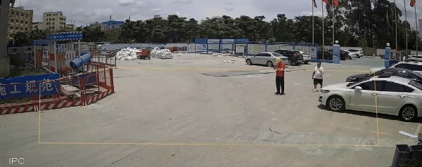

# Video Pedestrian Event Detection

<u>English</u>｜[中文](docs/README_ch.md)

<div style="text-align: center;">
  
  <p style="color: gray; font-size: 0.9em;">Pedestrian tracking and <b>gender recognition</b>(red: female, green: male)</p>
</div>

<div style="text-align: center;">
  
  <p style="color: gray; font-size: 0.9em;">Pedestrian tracking and <b>helmet wearing identification</b>(red: not wearing helmet, green: wearing helmet)</p>
</div>

## Quick Start
1. **Clone this repository**

    ```bash
    git clone https://github.com/thu-huangzc/VPED.git
    git pull
    ```
2. **Install necessary python packages**

    ```bash
    pip install -r requirements.txt
    ```
    > The Python version is 3.9.19 and the cuda version is 11.8. Of course, other python or cuda versions may also be possible. You can have a try.

3. **Download pre-trained model checkpoints**

    a. Pedestrain detection and tracking -> [yolov8m.pt](https://github.com/ultralytics/assets/releases/download/v8.2.0/yolov8m.pt)

    b. Helmet detection -> [helmet_head_person_epoch10.pt](https://drive.google.com/file/d/1PBXjppzax_pXkiDUIyoQC0jzAEWpM8I9/view?usp=sharing)

    c. CLIP model -> [clip-vit-base-patch16](https://huggingface.co/openai/clip-vit-base-patch16/tree/main)

    Then, place `yolov8m.pt` and `helmet_head_person_epoch10.pt` under `./ckpt/yolo/`, place `clip-vit-base-patch16` under `./ckpt/`

4. **Run demo**

    a. Upload videos for offline testing
    ```bash
    CUDA_VISIBLE_DEVICES=0 python demo.py --input TEST_VIDEO_PATH --event EVENT --draw-results
    ```

    b. Camera online test
    ```bash
    CUDA_VISIBLE_DEVICES=0 python demo.py --input webcam --event EVENT --draw-results
    ```
    * `input`: 'webcam' or input video file path;
    * `event`: 'gender' or 'helmet' (More behavioral recognition will be added later);
    * `draw-results`: whether to save the inference result video, which will be saved under `./inference/test_videos` by default.


## Notes
Related Projects: [Smart_Construction](https://github.com/PeterH0323/Smart_Construction), [yolo](https://github.com/ultralytics/ultralytics), [clip](https://github.com/openai/CLIP), [Safety-Helmet-Wearing-Dataset](https://github.com/njvisionpower/Safety-Helmet-Wearing-Dataset), [MiVOLO](https://github.com/WildChlamydia/MiVOLO)

If you find this project helpful, we would greatly appreciate it if you could give us a free star～
