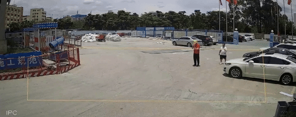

# 视频行人事件检测

[English](../README.md)｜<u>中文</u>

<div style="text-align: center;">
  
  <p style="color: gray; font-size: 0.9em;">行人追踪与<b>性别识别</b>（红色：女性，绿色：男性）</p>
</div>

<div style="text-align: center;">
  
  <p style="color: gray; font-size: 0.9em;">行人追踪与<b>安全帽佩戴识别</b>（红色：未佩戴安全帽，绿色：已佩戴安全帽）</p>
</div>

## 快速开始
1. **克隆此仓库**

    ```bash
    git clone https://github.com/thu-huangzc/VPED.git
    git pull
    ```
2. **安装必要的 Python 包**

    ```bash
    pip install -r requirements.txt
    ```
    > Python 版本为 3.9.19，CUDA 版本为 11.8。当然，也可以尝试其他版本的 Python 或 CUDA。
3. **下载预训练模型权重**

    a. 行人检测与跟踪 -> [yolov8m.pt](https://github.com/ultralytics/assets/releases/download/v8.2.0/yolov8m.pt)

    b. 安全帽检测 -> [helmet_head_person_epoch10.pt](https://drive.google.com/drive/folders/1f3z1MJ9K5zrn0tpNMhLMnO3gNTeNd6r_?usp=drive_link)

    c. CLIP 模型 -> [clip-vit-base-patch16](https://huggingface.co/openai/clip-vit-base-patch16/tree/main)

    然后, 将 `yolov8m.pt` 和 `helmet_head_person_epoch10.pt` 放置在 `./ckpt/yolo/`, 将 `clip-vit-base-patch16` 放置在 `./ckpt/`

4. **运行演示**

    a. 上传视频进行离线测试
    ```bash
    CUDA_VISIBLE_DEVICES=0 python demo.py --input TEST_VIDEO_PATH --event EVENT --draw-results
    ```

    b. 摄像头在线测试
    ```bash
    CUDA_VISIBLE_DEVICES=0 python demo.py --input webcam --event EVENT --draw-results
    ```

    * `input`: 'webcam' 或输入视频文件路径；
    * `event`: 'gender' 或 'helmet'（未来将添加更多行为识别功能）；
    * `draw-results`:是否保存推理结果视频，默认保存在 `./inference/test_videos`.

## 注意事项
相关项目: [Smart_Construction](https://github.com/PeterH0323/Smart_Construction), [yolo](https://github.com/ultralytics/ultralytics), [clip](https://github.com/openai/CLIP), [Safety-Helmet-Wearing-Dataset](https://github.com/njvisionpower/Safety-Helmet-Wearing-Dataset), [MiVOLO](https://github.com/WildChlamydia/MiVOLO)

如果您觉得这个项目对您有帮助，非常欢迎您为我们点一个免费的 star～